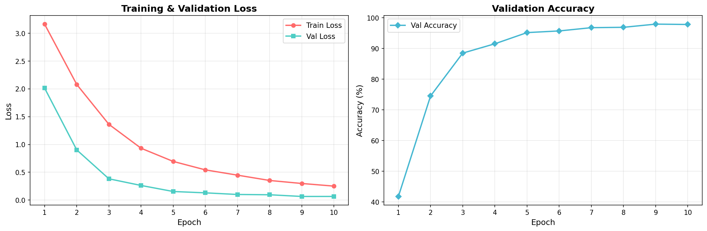

# 🌿 Plant Disease Classification using CNN (농작물 잎 병해충 진단)

본 프로젝트는 CNN(합성곱 신경망) 모델을 활용하여 농작물 잎의 이미지를 분석하고, 38가지의 다양한 병해충 상태(정상 상태 포함)를 분류 및 진단하는 딥러닝 프로젝트입니다.

---

## 📊 프로젝트 개요

- **목표**: 38개 클래스로 분류된 농작물 잎 이미지를 입력받아 병해충 진단 및 정상 상태 판별
- **프레임워크**: PyTorch, Albumentations (데이터 증강)
- **최종 검증 정확도 (Val Accuracy)**: **97.92%** (9 Epoch)
- **주요 파일 구성**:
  - `model.py`: 커스텀 `PlantDiseaseCNN` 모델 아키텍처 정의
  - `dataset.py`: Albumentations 전처리/증강 및 PyTorch Dataset, DataLoader 구축
  - `train.py`: 커맨드 라인 학습 실행 스크립트
  - `run_training.ipynb`: 학습 실행, 이력 기록 및 결과 그래프 시각화 주피터 노트북
  - `training_results.png`: 학습 Loss 및 Validation Accuracy 추이 그래프
  - `.gitignore`: 데이터셋 및 모델 가중치 파일 등 대용량 파일 업로드 방지 설정

---

## 📂 데이터셋 (Dataset)

- **데이터셋명**: New Plant Diseases Dataset (Augmented)
- **데이터 크기**: 
  - **Train**: 140,590장 (38 classes)
  - **Validation**: 35,144장 (38 classes)
- **이미지 크기**: 224 × 224 (RGB)
- **데이터 증강 (Augmentation)**:
  - `Resize` (224x224)
  - `Rotate` (±30도)
  - `HorizontalFlip` (좌우 반전)
  - `ColorJitter` (밝기, 대비, 채도, 색상 임의 변경)
  - `Normalize` (ImageNet 표준 평균 및 표준편차 적용)

---

## 🏗️ 모델 아키텍처 (Model Architecture)

`PlantDiseaseCNN` 모델은 다음과 같이 4개의 Convolutional Block과 1개의 Fully Connected 분류기로 구성되어 있습니다.

```
Input: (3, 224, 224)
  ↓
[Conv Block 1] Conv2d(3→32) + BatchNorm + ReLU + MaxPool2d  → (32, 112, 112)
  ↓
[Conv Block 2] Conv2d(32→64) + BatchNorm + ReLU + MaxPool2d → (64, 56, 56)
  ↓
[Conv Block 3] Conv2d(64→128) + BatchNorm + ReLU + MaxPool2d → (128, 28, 28)
  ↓
[Conv Block 4] Conv2d(128→256) + BatchNorm + ReLU + MaxPool2d → (256, 14, 14)
  ↓
[Classifier]   Flatten + Linear(50,176→512) + ReLU + Dropout(0.5) + Linear(512→38)
```
- **총 파라미터 수**: 26,099,494개 (약 2,600만)

---

## 📈 학습 결과 (Training Results)

- **에포크(Epochs)**: 10
- **옵티마이저 (Optimizer)**: Adam (Learning Rate: 0.001)
- **손실 함수 (Loss Function)**: CrossEntropyLoss
- **성능 기록**:
  - **Best Epoch**: 9
  - **Best Val Accuracy**: **97.92%**
  - **Best Val Loss**: 0.0639

### Loss 및 Accuracy 시각화



---

## 🚀 사용법 (How to Run)

### 1. 가상환경 구축 및 패키지 설치
```bash
pip install torch torchvision albumentations opencv-python matplotlib tqdm jupyter
```

### 2. 데이터셋 배치
로컬 환경의 데이터셋 폴더 구조를 아래와 같이 배치해야 합니다. (Git 업로드에서는 제외됨)
```
New Plant Diseases Dataset(Augmented)/
└── New Plant Diseases Dataset(Augmented)/
    ├── train/
    │   ├── Tomato___Healthy/
    │   └── ... (38개 클래스 폴더)
    └── valid/
        ├── Tomato___Healthy/
        └── ... (38개 클래스 폴더)
```

### 3. 학습 모델 실행
**스크립트로 실행 시**:
```bash
python train.py
```
**주피터 노트북으로 실행 및 분석 시**:
`run_training.ipynb` 파일을 열어 순차적으로 셀을 실행시킵니다.
```bash
jupyter notebook run_training.ipynb
```
